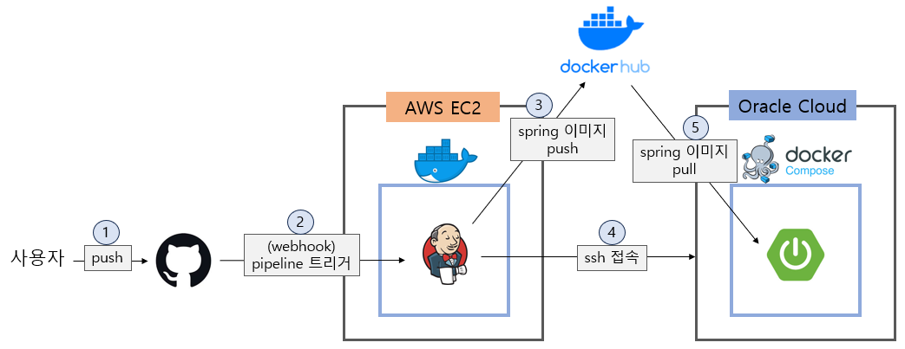

# jenkins와 docker를 이용한 자동배포 

1. git master 브랜치에 코드 push
2. webhook으로 jenkins 파이프라인 트리거
3. (jenkins) springboot 코드를 빌드
4. springboot 도커 이미지 생성, docker hub로 push
5. ssh로 spring 서버 접속
6. (jenkins) docker-compose pull 후, docker-compose up

