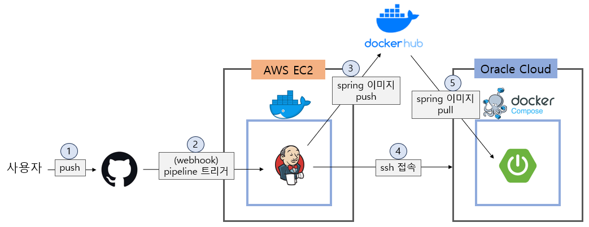
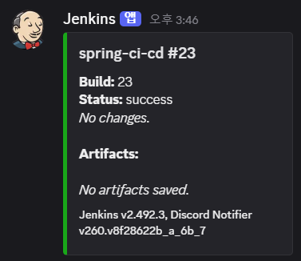

# jenkins와 docker를 이용한 자동배포 V1

1. git master 브랜치에 코드 push
2. webhook으로 jenkins 파이프라인 트리거
   1. springboot 코드를 빌드
   2. springboot 도커 이미지 생성, docker hub로 push
   3. ssh로 spring 서버 접속
   4. docker-compose pull 후, docker-compose up
   5. Discord로 알림 발송

 

### 문제점
1. readme와 같은 문서 수정 시에도 새로 빌드&배포되어 비효율적
2. 매번 새로운 docker 이미지가 만들어져 hub에 전송되어 쌓임

